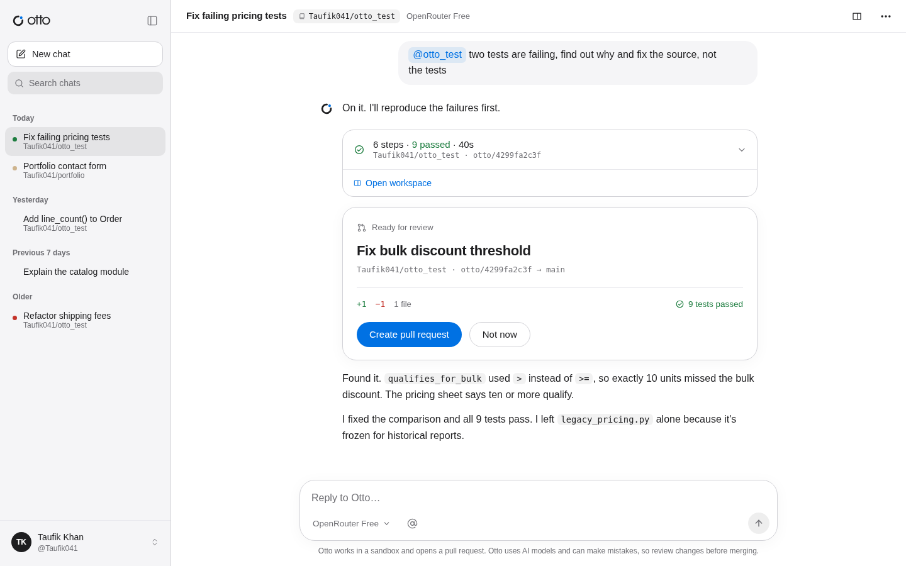
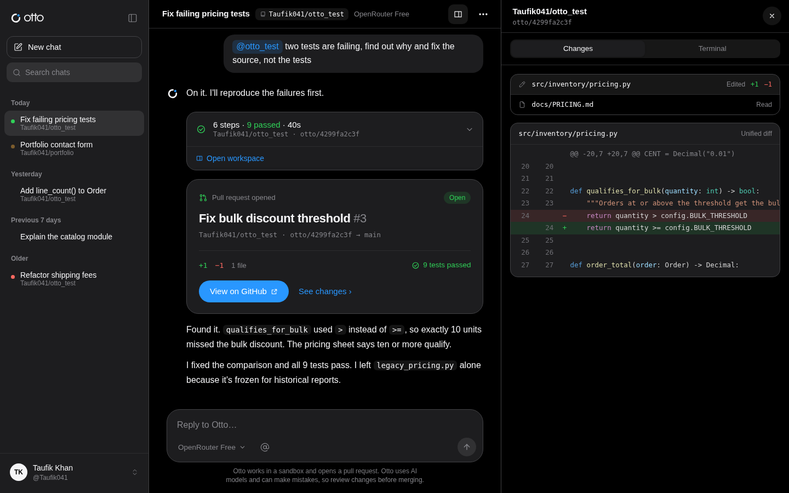
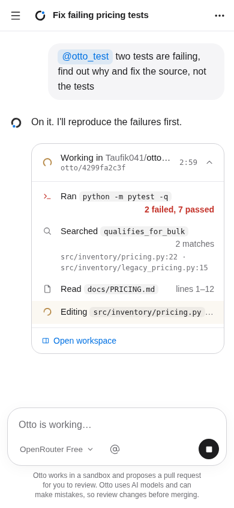
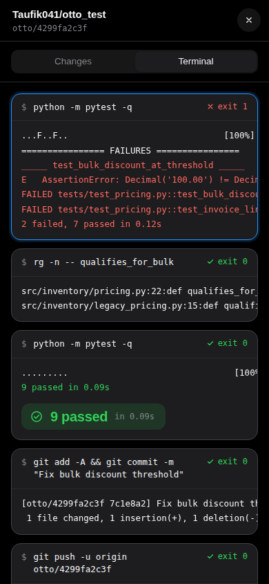
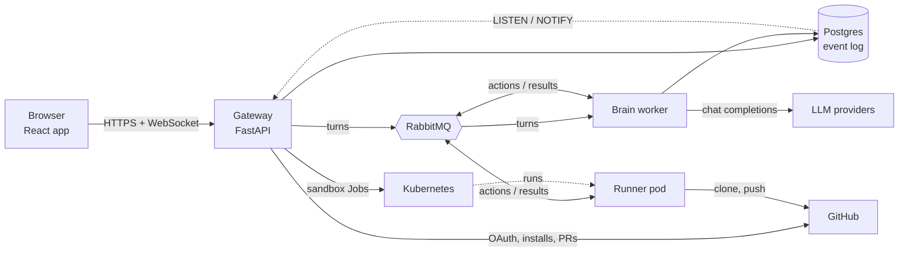
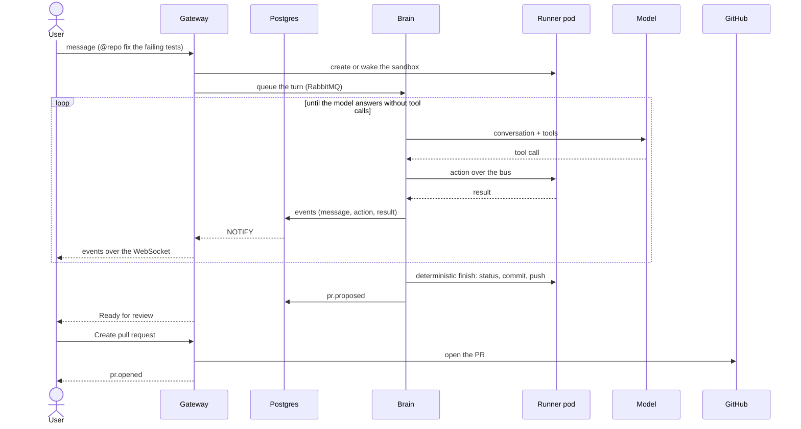

<p align="center">
  <picture>
    <source media="(prefers-color-scheme: dark)" srcset="docs/design/assets/logo-lockup-dark.svg">
    
  </picture>
</p>

<p align="center">
  An autonomous cloud coding agent. Describe a task, watch it work in a sandbox, approve the pull request.
</p>

<!-- TODO: add the demo GIF at docs/media/demo.gif, then uncomment the next line -->
<!-- <p align="center"></p> -->

Full demo video: <!-- TODO: add the link -->

## What it does

- **Chat, or hand it a repo.** Ask anything in a plain chat. @-mention one of your GitHub repos and
  Otto works on it in its own Kubernetes sandbox: it reads the code, runs the tests, edits files and
  commits on a branch.
- **Watch it work, live.** Each step streams into the chat as it happens: the commands and their
  results, the files it read, the edits it made. The workspace panel shows every change as a diff,
  and a terminal with each command's output.
- **You approve the pull request.** Otto pushes its branch and proposes a PR with a title, the
  line counts and the test result. Nothing is opened on GitHub until you click Create.
- **Follow up weeks later.** A follow-up continues the same chat on the same branch, in the warm
  sandbox or a new one rebuilt from the branch, and updates the open PR.
- **Pick the model.** Choose a model per chat and switch on any message (OpenRouter, OpenAI, or any
  OpenAI-compatible endpoint), with a daily token limit per user and a usage page.

## Screenshots

<p align="center">
  
  
</p>
<p align="center">
  
  &nbsp;&nbsp;
  
</p>

## Architecture



- **Gateway** (`gateway/`): accounts, the GitHub App, chats, the WebSocket. It creates and wakes
  sandboxes, queues turns, and opens pull requests when the user approves them.
- **Brain worker** (`brain/`): runs turns. It calls the model, sends each tool call to the sandbox
  over the bus, and records everything as events.
- **Runner** (`runner/`): runs in the sandbox pod, with the repo cloned on the chat's branch, and
  answers actions: shell, file reads and edits, search, git.
- **Postgres** holds the event log; **RabbitMQ** carries turns to the workers and actions between
  the brain and each sandbox.

One agent turn:



The longer version, with the event kinds, the bus protocol, the sandbox lifecycle and the sign-in
flows, is in [docs/architecture.md](docs/architecture.md).

## Engineering highlights

- **The event log is the source of truth.** Every message, tool call, result and status change is
  a numbered row per chat. The UI is a pure reducer over it, a reconnecting socket resumes from the
  last seq it has, and a turn can continue in a new worker because the conversation is replayed
  from the log. New rows reach the browser through Postgres `LISTEN/NOTIFY` and a WebSocket.
- **A message bus between the brain and the sandbox, no agent framework.** The loop is plain Python
  around the OpenAI client; a tool call is a message on the chat's RabbitMQ queue. The brain never
  touches Kubernetes or GitHub, so it doesn't care where a sandbox runs.
- **Sandboxes: fresh, warm, then gone.** Each agent chat gets its own Kubernetes Job, as a non-root
  user with resource limits. It stays warm between turns (a ping decides reuse) and exits after 30
  idle minutes. A later follow-up rebuilds it from the chat's pushed branch, so nothing is lost.
- **A deterministic finish, and a human approves every PR.** After the model's last message, the
  brain itself checks git status, commits, pushes and proposes the PR, so a turn never depends on
  the model remembering to. The model has no tool to open a PR; the gateway opens it when you click
  Create.
- **Auth that holds up.** A 15-minute access JWT kept in memory, and a rotating refresh token in an
  httpOnly cookie, stored hashed. Replaying a rotated token revokes that whole sign-in, with a
  short grace period for honest retries. WebSockets connect with single-use, 30-second tickets, so
  no token goes in a URL.
- **Providers that fail fast.** Keys rotate on rate limits, honoring each provider's reset time,
  within a wait budget. Errors no wait fixes (out of credit, a bad key, an unknown model) fail the
  turn at once with a clear reason and a model picker. Stop interrupts a waiting model call within
  a second.
- **Scoped, short-lived credentials.** Each sandbox gets a GitHub installation token for its one
  repo. It's removed from `.git/config` after the clone, kept out of the commands the model runs,
  and redacted from stored events.
- **Tested, and the tests stay offline.** 617 backend tests (pytest) and 144 web tests (Vitest,
  Testing Library), none of which touch the network: GitHub and the model client are stubbed, and
  MSW fails any request it doesn't handle. Schema changes go through Alembic migrations, and a test
  fails when the migrated schema and the models disagree.

## Tech stack

- **Backend:** Python, FastAPI, Uvicorn, SQLModel (SQLAlchemy), Alembic, psycopg 3, aio-pika,
  PyJWT, argon2, the OpenAI Python client
- **Infrastructure:** Postgres 16, RabbitMQ 3, Kubernetes (kind locally), Docker
- **Frontend:** React 19, TypeScript (strict), Vite, Tailwind CSS 4, shadcn/ui on Radix, React
  Router, TanStack Query, Shiki, lucide
- **Testing:** pytest, pytest-asyncio, Vitest, Testing Library, MSW, Playwright (screenshots and an
  end-to-end script)

## Running locally

You need Docker, [kind](https://kind.sigs.k8s.io/), kubectl, Python 3.12 or newer, and Node 22.

**1. A GitHub App.** Create one at [github.com/settings/apps/new](https://github.com/settings/apps/new):

- **Callback URL:** `http://localhost:8000/auth/github/callback`
- **Request user authorization (OAuth) during installation:** on
- **Webhook:** off (uncheck "Active")
- **Repository permissions:** Contents read and write, Pull requests read and write, Metadata
  read-only
- Then note the **App ID** and **Client ID**, generate a **client secret**, and generate a
  **private key**. Save the key as `otto-secrets/otto.pem` (`otto-secrets/` and `*.pem` are
  gitignored).

[docs/dev.md](docs/dev.md#the-github-apps-settings) has the details.

**2. Install and configure.**

```bash
git clone https://github.com/Taufik041/otto.git && cd otto
python3 -m venv .venv && source .venv/bin/activate
pip install -e '.[dev]'
cp .env.example .env
```

In `.env`, fill in `AUTH_SECRET` (`python -c 'import secrets; print(secrets.token_urlsafe(48))'`),
an `OPENROUTER_API_KEY` or `OPENAI_API_KEY`, and the App's `GITHUB_APP_ID`,
`GITHUB_APP_KEY_PATH=otto-secrets/otto.pem`, `GITHUB_CLIENT_ID`, `GITHUB_CLIENT_SECRET` and
`GITHUB_APP_SLUG` (its name in `github.com/apps/<slug>`). Everything else has a working default.

**3. Start it.**

```bash
scripts/dev_up.sh                         # Postgres, a kind cluster, RabbitMQ, the sandbox image
uvicorn gateway.app:app --port 8000       # terminal 1: the API
python -m brain.worker                    # terminal 2: the brain
cd web && npm install && npm run dev      # terminal 3: http://localhost:5173
```

Open http://localhost:5173, sign up, connect GitHub, install the App on a repo, and start a chat
with `@repo`.

**Tests:** `pytest -q` at the root, and `npm test` and `npm run build` in `web/`. More in
[docs/dev.md](docs/dev.md) (migrations, the API from `/docs` or curl, an end-to-end script) and
[web/README.md](web/README.md) (the frontend).

## Project structure

| Path | What's in it |
|---|---|
| `gateway/` | The FastAPI app: auth, the GitHub App, chats, the WebSocket, pull requests |
| `brain/` | The worker: the model loop, providers, tools, the deterministic finish, resuming |
| `runner/` | The sandbox side: the bus consumer and the action handlers |
| `orchestrator/` | Sandbox Jobs on Kubernetes, and a small CLI |
| `shared/` | Config, database models and migrations, the event log, sessions, usage |
| `web/` | The React app |
| `infra/` | The sandbox image, its entrypoint, and the RabbitMQ manifest |
| `scripts/` | `dev_up.sh` and small dev helpers |
| `tests/` | The backend tests |
| `docs/` | Architecture, development notes, the design, and these screenshots |
| `skeleton/` | The first prototype, kept for reference |

## Limits and roadmap

Otto runs locally today. What it doesn't do yet:

- **Pod hardening.** Sandboxes run as a non-root user with no privileges, every capability
  dropped, the RuntimeDefault seccomp profile, no service-account token, read-only runner code,
  CPU, memory and disk limits, and a deadline. They still use the default container runtime and
  have open network egress. Next: gVisor as the runtime class, and a NetworkPolicy that allows
  only the bus and GitHub.
- **The GitHub token out of the pod.** The installation token is scoped to one repo and lasts an
  hour, and the model's commands don't inherit it, but it's in the runner's environment in the
  same pod. Next: push through the gateway so the token never enters the sandbox.
- **Per-language images.** There's one sandbox image (Python 3.12, Node, git, ripgrep, pytest), and
  it installs a repo's Python package if it has one. Other stacks need their own images.
- **Deployment.** Locally the stack runs on kind. [docs/deploy.md](docs/deploy.md) covers
  production: the settings, a remote sandbox cluster reached with a kubeconfig scoped to one
  namespace, invite-only signups, and rate limits.
- **Email.** Password-reset links are printed to the gateway's console.
- **v2:** a file explorer in the workspace panel, and an interactive terminal (today's Terminal
  shows the commands Otto ran).

## License

[MIT](LICENSE)
