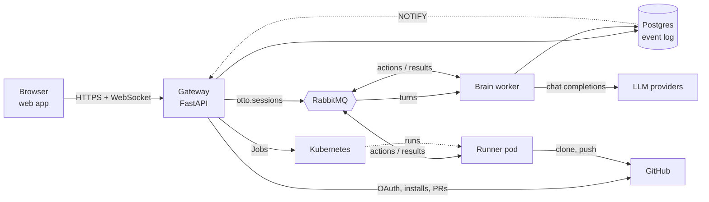
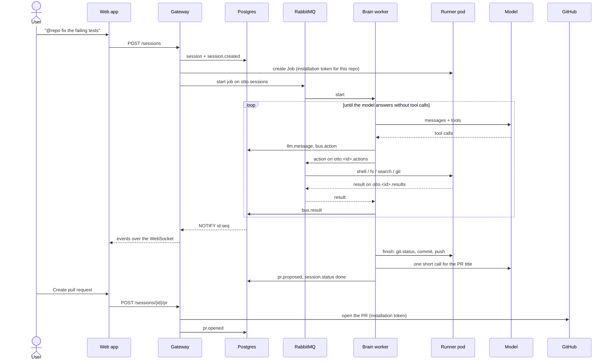

# Otto's architecture

This is the longer version of the README's overview: the components, the rules they keep, what
happens in a turn, the event log, sign-in, and a sandbox's life. `docs/dev.md` has the endpoints
and settings in full; `web/README.md` has the frontend.

## Components

| Component | Code | What it does |
|---|---|---|
| Web app | `web/` | React single-page app. Renders a chat from its event log and follows new events over a WebSocket. |
| Gateway | `gateway/` | FastAPI. Accounts and sign-in, the GitHub App, chats, the WebSocket, opening pull requests. Creates and wakes sandboxes, and queues turns for the brain. |
| Brain worker | `brain/` | Runs turns: the model loop, tool calls over the bus, the deterministic finish, titles. Several turns at once (`WORKER_CONCURRENCY`). |
| Runner | `runner/` | Runs inside a sandbox pod. Clones the repo onto the chat's branch, then answers actions from the bus: shell, files, search, git. |
| Orchestrator | `orchestrator/` | Creates, inspects and removes sandbox Jobs through the Kubernetes API. Used by the gateway (and a small CLI). |
| Shared | `shared/` | Config, the database models and Alembic migrations, the event log, session state, usage, bus message shapes. |
| Postgres | | Users, chats, the event log, usage, refresh tokens, provider health. `LISTEN/NOTIFY` carries new-event signals to the gateway. |
| RabbitMQ | | The session queue (gateway → brain) and each chat's action and result queues (brain ↔ runner). |
| Kubernetes | | One Job per working chat (kind locally). |
| GitHub | | Sign-in, the App's installations, clone and push with short-lived installation tokens, pull requests. |

## Rules the code keeps

- **The event log is the record.** Everything a chat did is a row in `session_events`, numbered
  per chat (`seq`). The UI, resuming a turn and retries all read it.
- **The brain talks only to the bus and Postgres.** It never calls Kubernetes or GitHub, and it
  doesn't know where a sandbox runs. Only the gateway and the orchestrator touch Kubernetes.
- **The model gets tools, not credentials.** The sandbox's GitHub token is kept out of the
  commands the model runs, out of `.git/config`, and out of stored events (secrets matching known
  token shapes are redacted before an event is written).
- **Pull requests are the user's call.** The model has no tool that opens one. A turn ends with a
  proposal; the gateway opens the PR only when the user asks.
- **Schema changes are migrations.** The models live in `shared/models.py`, and every change is a
  new Alembic migration in `shared/migrations/versions/` (14 so far). A test fails when the
  migrated schema and the models disagree.
- **Tests never touch the network.** The backend tests stub GitHub and the model client and run
  on SQLite; the web tests fail on any request MSW doesn't handle.

## A turn

1. **The message.** `POST /sessions` with a message, and a repo when the user @-mentions one. With a
   repo it's an agent chat; without one it's a plain chat, answered by the model with no sandbox. A plain chat can
   get a repo later, and becomes an agent chat (`repo.attached`).
2. **The sandbox.** For an agent chat, the gateway checks the per-user and global caps
   (`MAX_ACTIVE_SESSIONS`, `MAX_ACTIVE_SANDBOXES`) and the daily token limit, then creates the
   chat's Job, or wakes its warm one (below). The status goes `provisioning` → `queued`.
3. **The queue.** The gateway puts `{type: start | resume | chat | retry, session_id}` on
   `otto.sessions`. A worker claims it by moving the status from `queued` to `running` (a
   compare-and-set in Postgres), and only then acks the message. A turn another worker already
   took, or one the user stopped, is skipped.
4. **The loop.** The brain rebuilds the conversation from the event log, then calls the model
   with the tools (`shell_exec`, `fs_read`, `fs_write`, `fs_replace`, `code_search`,
   `git_status`, `git_diff`, `git_commit`, `git_push`), at most 20 steps a turn. Each tool call
   is a bus action to the runner, and each answer a result; both are events. Results carry extra
   fields for the UI (a unified diff, line counts, a diffstat), which the brain strips before the
   model sees them.
5. **Live.** Every event is written with `pg_notify('otto_events', '<id>:<seq>')` in its own
   transaction. The gateway listens, reads the new rows and pushes them to each open WebSocket.
6. **The finish.** After the model's last message, the brain does what the model left undone
   (below), then sets `done`.
7. **The pull request.** The user clicks "Create pull request"; the gateway opens it with the
   installation's token and appends `pr.opened`. "Not now" appends `pr.declined`, and the proposal
   stays available.

A follow-up (`POST /sessions/{id}/messages`) is stored as the next user message at once, then
runs as a `resume` turn in the same sandbox if it's still warm, or a new one built from the
branch. It may switch the model (`session.model_changed`). Stop (`POST /sessions/{id}/stop`) sets
`stopped` first, so the worker ends after its current step, and removes the sandbox. Retry runs a
`failed` or `interrupted` turn again from where it stopped, optionally on another model.

### Statuses

`pending` → `provisioning` → `queued` → `running` → `done` | `failed` | `interrupted` | `stopped`
| `limited`. Every change is a `transition(id, to, allowed_from)` that succeeds only from the
statuses it names, so a stop, a retry and a worker can't overwrite each other. When the gateway
starts, it marks chats left `queued` or `running` by a dead worker as `interrupted`, so they can
be retried.

### The deterministic finish

The model is asked to commit and push, but a turn shouldn't depend on it remembering. After its
final message, `finish` in `brain/loop.py` runs ordinary bus actions:

1. `git.status`: is anything uncommitted, is `otto/<id>` ahead of the remote?
2. Commit what's uncommitted, with a message from the turn's request.
3. Push if the branch is ahead.
4. With no PR open: `pr.proposed {title, body, head, base, additions, deletions, files, tests}`.
   The title is one short model call (plain sentence case, at most 60 characters, conventional
   commit prefixes stripped); if that call fails, it's the trimmed task. With a PR already open,
   the push updated it: `pr.updated`.

The finish is skipped for plain chats, stopped turns, and turns that ran nothing that could change
the workspace. A failed step ends the turn `failed` with `error {stage: "finish", step}`, and
Retry runs it again.

## The event log

`session_events (session_id, seq, ts, type, payload)`, with `(session_id, seq)` as the primary
key. A writer takes the next seq and retries on a conflict. The gateway serves the log over HTTP
(`GET /sessions/{id}/events?after_seq=`) and over the WebSocket, which replays from `after_seq` and
then streams. A client that reconnects passes the last seq it has and misses nothing.

| Kind | Payload | Written by |
|---|---|---|
| `session.created` | `{task, repo, model}` | gateway |
| `session.status` | `{status}` | gateway, brain |
| `session.model_changed` | `{from, to}` | gateway |
| `session.titled` | `{title, source}` | brain |
| `repo.attached` | `{repo}` | gateway |
| `llm.message` | `{message}`: an OpenAI-format chat message (system, user, assistant, tool) | gateway (user follow-ups), brain |
| `llm.usage` | the call's token counts | brain |
| `llm.key_rotated` | `{provider, from_index, to_index, reason}` (indexes, never keys) | brain |
| `bus.action` | `{action_id, kind, payload}` | brain |
| `bus.result` | `{action_id, ok, payload}` | brain |
| `pr.proposed` | `{title, body, head, base, additions, deletions, files, tests}` | brain |
| `pr.updated` | `{number, url, additions, deletions, files}` | brain |
| `pr.opened` | `{number, html_url}` | gateway |
| `pr.declined` | `{}` | gateway |
| `usage.limit_reached` | `{used, limit, resets_at}` | brain |
| `error` | `{stage, step?, reason?, message}` | gateway, brain |
| `sandbox.reused`, `sandbox.recreated` | `{}`, `{previous}` | gateway |

The web app turns this into the chat view with one pure reducer (`web/src/chat/reduce.ts`);
`web/README.md` maps every kind to what the chat shows.

Because the conversation is replayed from `llm.message` events (`brain/resume.py`), a turn can
continue in a new worker or a new sandbox. A tool call whose result was lost (the chat was stopped
mid-step) gets a synthetic "interrupted" result, so the history stays valid for the model's API.

## The bus

| Queue | From → to | Messages |
|---|---|---|
| `otto.sessions` | gateway → brain workers | `{type, session_id, text?}` |
| `otto.<id>.actions` | brain (and the gateway's control messages) → the chat's runner | `{session_id, action_id, kind, payload}` |
| `otto.<id>.results` | runner → brain | `{session_id, action_id, kind: "<kind>.result", ok, payload}` |

Action kinds: `shell.exec`, `fs.read`, `fs.write`, `fs.replace`, `code.search`, `git.status`,
`git.diff`, `git.commit`, `git.push` (and `git.open_pr`, which nothing calls any more), plus
`control.ping` and `control.shutdown` from the gateway. The brain matches results to actions by
`action_id` and waits up to 120 seconds for each.

There is no agent framework: the loop is plain Python around the OpenAI client, and a tool call
is a message on a queue.

## Sandboxes

- **Fresh per chat.** Each agent chat gets its own Kubernetes Job, `otto-<id>`, running the
  sandbox image (Python 3.12, Node, git, ripgrep, pytest) as a non-root user, with the runner's
  code read-only. Requests 200m CPU and 300Mi memory; limits 1 CPU and 1Gi.
- **Scoped credentials.** The gateway mints a GitHub installation token for the chat's one repo
  (it lasts an hour) and passes it in the pod's environment. The entrypoint clones with it and
  removes it from `.git/config` at once; pushes add it as a header for that one command; commands
  the model runs get an environment without it.
- **On the chat's branch.** The entrypoint checks out `otto/<id>`, tracking the remote branch if
  it was pushed before, and installs the repo's Python package if it has one.
- **Warm between turns.** After a turn the runner keeps waiting for actions. A follow-up pings it
  (`control.ping`); if it answers, the turn reuses it (`sandbox.reused`).
- **Idle exit.** The runner exits after `SANDBOX_IDLE_MINUTES` (30) without an action. The Job's
  deadline (`SANDBOX_MAX_AGE_SECONDS`, 3000) keeps a pod from outliving its token, and finished
  Jobs are cleaned up after 100 seconds.
- **Rebuilt from the branch.** If the ping gets no answer, the gateway removes the old Job, purges
  the chat's queues, and creates a new sandbox (`sandbox.recreated`). It clones `otto/<id>`, so
  pushed work carries over: a follow-up weeks later continues where the chat left off.

## Accounts and sign-in

- **Sign-up and sign-in:** email and password (argon2), or GitHub.
- **Access token:** a JWT (HS256, `AUTH_SECRET`) for `ACCESS_TOKEN_MINUTES` (15), sent as
  `Authorization: Bearer`. It carries the user's `token_version`, so signing out everywhere or
  changing the password voids every access token at once.
- **Refresh token:** an opaque random string in the `otto_refresh` cookie (httpOnly, SameSite=Lax,
  `Path=/auth`), stored only as a SHA-256. Each `POST /auth/refresh` swaps it for a new one in the
  same family.
- **Reuse detection:** presenting a token that was already swapped out revokes its whole family
  (that sign-in, on every device holding a copy). The one exception is a retry within
  `REFRESH_REUSE_GRACE_SECONDS` (20) of the rotation, from a lost response or two tabs refreshing
  at once, which gets a sibling token. Every token records why it ended: `rotated`, `logout`,
  `reuse`, `password` or `logout_all`.
- **CSRF:** the API reads only the `Authorization` header, which a cross-site page can't set. The
  two endpoints that read the cookie (`/auth/refresh`, `/auth/logout`) also check `Origin`.
- **WebSocket tickets:** a browser can't put a Bearer header on a WebSocket, and a token in the
  URL would end up in logs. The app asks `POST /sessions/{id}/ws-ticket` for a ticket that is
  single use and lasts 30 seconds, and connects with it.
- **The web app** keeps the access token in memory only, refreshes on load, on a 401 (then retries
  once), and a minute before expiry, and makes refreshes single-flight across tabs with
  `navigator.locks`.

### GitHub

Otto is a GitHub App. One OAuth flow covers signing in with GitHub, linking GitHub to a password
account, and installing the App on repositories ("request user authorization during
installation"). The OAuth `state` is signed with `AUTH_SECRET` and tied to a nonce cookie. Otto
uses the user's GitHub token once, to learn who they are and which installations they can see, and
doesn't keep it. Everything else uses installation tokens minted from the App's private key: one
scoped to a single repo for each sandbox, and short-lived ones in the gateway for listing repos
and opening pull requests.

## Models and providers

- **The catalog** (`GET /models`) is built from the configured keys (OpenRouter, OpenAI, or any
  OpenAI-compatible endpoint), or set outright with `OTTO_MODELS`. Each chat has a model and can
  switch it on any follow-up or retry.
- **Keys rotate.** A provider can have several keys (`OPENROUTER_API_KEY`, `..._KEY2`, ...). A 429
  cools that key down for the provider's own reset time (`Retry-After` and friends) and the next
  key is tried at once. A call's total waiting is capped (`MODEL_WAIT_BUDGET_SECONDS`).
- **Fail fast.** Errors no wait fixes (out of credit, a bad key, an unknown model) drop the key for
  the worker's lifetime. With no key left, the turn fails with a reason the UI names, and
  `provider_health` marks the provider, so the gateway refuses new turns on it with a hint until
  it restarts.
- **Stop interrupts** a model call within a second, whether it's waiting on a cooldown or on the
  request.
- **Usage.** Every call's tokens are recorded (`llm.usage`, and a usage table that outlives
  deleted chats). Each user has a daily token limit (`DAILY_TOKEN_LIMIT`, UTC days): new turns are
  refused with a 429 past it, and a turn that reaches it mid-way ends `limited`.
